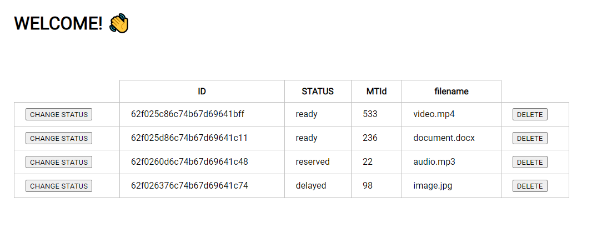
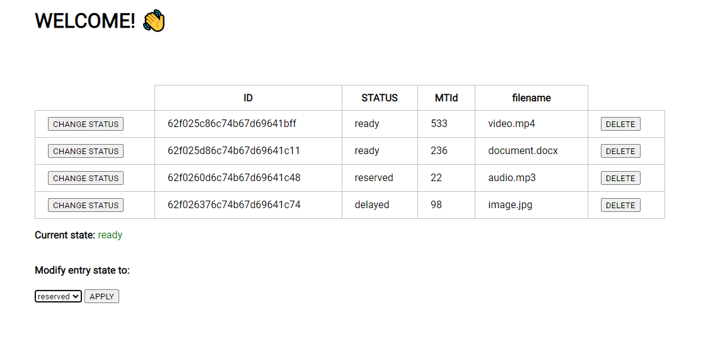

# Beanstalkd API Helper

This project contains an API developed in NodeJS that allows to keep track of taks saved in a database.

The entire application is contained within the `src` folder.

`package.json` contains the libraries needed for the project to run and the scripts to start the application.

`.env` contains the environment variables needed to make the execution of the project and the database possible in the local machine and in a docker instance.

It uses `Dockfile` and `docker-compose.yml` allow the built of the two instances needed to run the applicaiton in the docker (the api itself and the database).

--- 

#### Run the app locally

    npm install 
Will Install all dependecies stated in the `package.json` file.
    
    npm start
Will start the application.

#### Run the app on Docker
First, the two docker images must be build.

    docker build -t helper-api .
    
The `-t` parameter allows the user to give the image a name. In this case it has been given the name `helper-api`, this is optional. The second paramenter `.` indicates were the image should be stored.

Next, the `docker-compose.yml` file will be built and the image will be started in a container.

    docker-compose build
    docker-compose up -d

The `-d` parameter implies the docker terminal will be detached from the current terminal, it is opcional.

Since the `Dockerfile` already contains the commands to install dependencies and run the app, the application should already be running.

---

# App Use Guide

Once the application is running, its usage is the same in both the local machine or the Docker, this guide will be covering both cases.

## API

To access the API functionalities eight endpoints have been defined.

##### The GET petitions
These functionalities can be tested in the URL of the browser with the app running
`http://localhost:3000/api/task` -> Sens a `GET` petition to retrieve all the exiting tasks
`http://localhost:3000/api/task/remaining-tasks-amount` -> Sens a `GET` petition to count how many tasks are in **ready** state
`http://localhost:3000/api/task/active-tasks-amount` -> Sens a `GET` petition to count how many tasks are in **reserved** state

##### The POST, PUT and DELETE petitions
To trigger this functionalitites an additional tool like *Postman* are needed.

`DELETE http://localhost:3000/api/task/[task_id]` -> Removes from the database the task with id `task_id`.
`POST http://localhost:3000/api/task/` -> Sends a request with a JSON message containing the data for the new task.
`PUT http://localhost:3000/api/task/[task_id]/status/[new_status]` -> Modifies the task with id `task_id`'s **status** to `new_status`.

---

## Graphic User Interface

The GUI is available at `http://localhost:3000/gui`. This simple interface allows testing some of the functionalities presented above. 
Every second there is a `GET` petition to retrieve all the tasks from the database, these are shown on a table. 
)

**NOTE**: The frist time the app is launched there will be no data in the database, make sure to send some `POSTS Requests` with Postman or similar to have some data to play with!

The UI allows the user to either **delete** a task or **edit the status** of a task. 
)

The **CHANGE STATUS** button unfolds a drop down menu which allows to change the status of the two existing states (excluding the one the task currently is). Once an option is selected and the **APPLY** button is clicked the task will be updated in the database and one second later this change will be visible in the table containing all tasks.

The **DELETE** button will remove an entry completely from the database and it will disappear from the table.